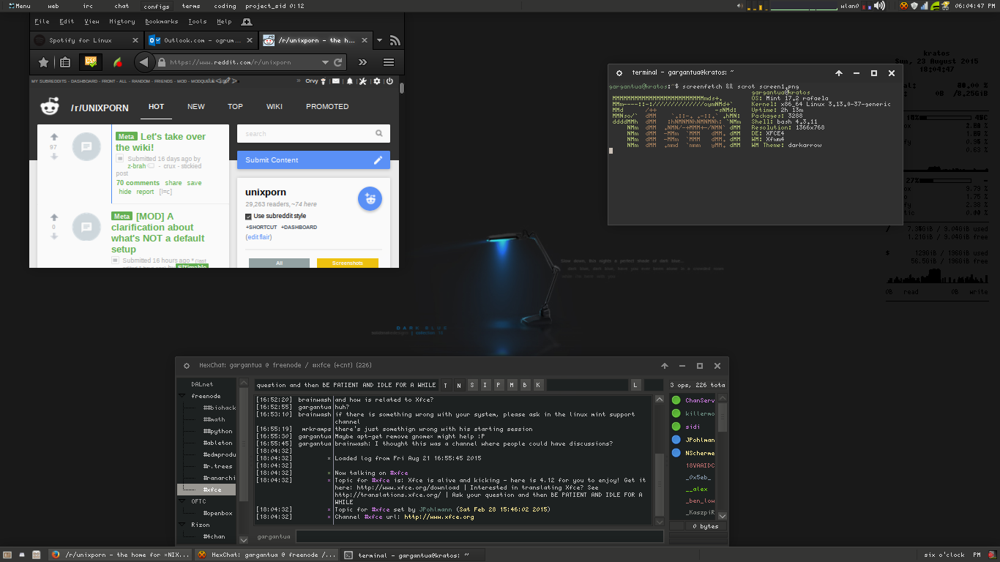

This is a modified version of numix , visit them at [Numix Project](http://numixproject.org).


It's meant to be used for xfce, right now, it looks like this:


### Manual installation

Extract the zip file to the themes directory i.e. `/usr/share/themes/`

To set the theme in Gnome, run the following commands in Terminal,

```
gsettings set org.gnome.desktop.interface gtk-theme "darkarrow"
gsettings set org.gnome.desktop.wm.preferences theme "darkarrow"
```

To set the theme in Xfce, run the following commands in Terminal,

```
xfconf-query -c xsettings -p /Net/ThemeName -s "darkarrow"
xfconf-query -c xfwm4 -p /general/theme -s "darkarrow"
```
